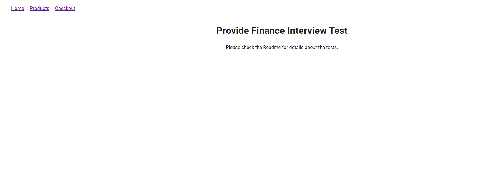
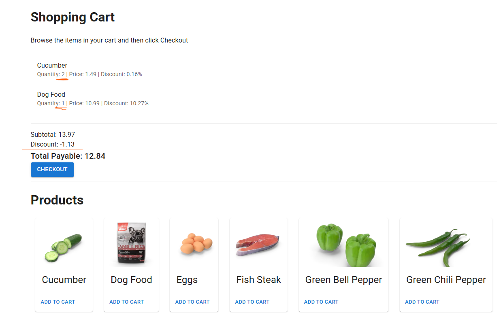
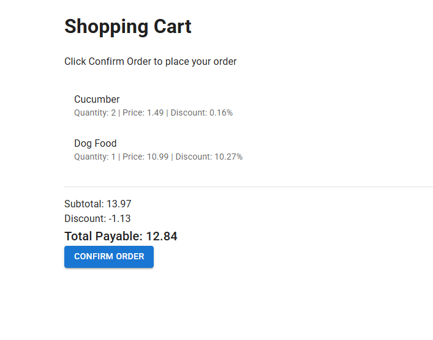
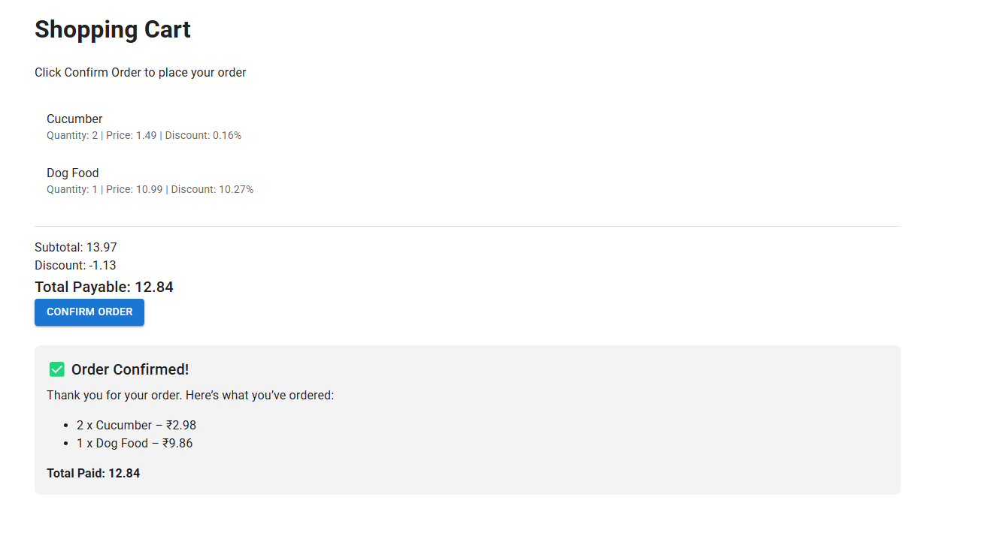

# Provide Interview Tests

#### Please note that this code uses Node 14

Please clone or fork this repository, complete the tasks in your cloned repository and then once completed share it with us.

If you have trouble cloning the repository, please ensure you are not using SSH.

### Cloning this Repo

You should be able to clone the repository using: `git clone https://bitbucket.org/providefinanceltd/react.git`

If you prefer to use GitHub, you can use this link which provides an exact copy of this repository: [GitHub Repository](https://github.com/DennisBold/provide-react)

You should push the code to your own repository, either on GitHub or any other Git-based service. You will not have permission to push, branch or make changes to this repository. This was done so that your code remains private from other candidates.

### Starting the App

In your cloned repository, from the project directory, run:

#### `npm start`

This action will open up our test application in your web browser. (Be warned - the application is in a broken state, and your task will be to fix it.)

This README contains a series of tasks which involve fixing bugs and adding features to this application.
Please complete these tasks in their given order, and commit the solutions to each task as individual commits. You are advised to refer to the task number in your commit message.

Once completed, please share your cloned repository with us.

Best of luck!

## Overview of the Application

This application is a basic E-Commerce interface created with create-react-app.

The application enables a user to browse products and add them to a basket.

Once the products have been added to the basket, the user can checkout their shopping basket and view the total cost of their order.

- `/products` - Shows a list of available products to a user.
- `/checkout` - Displays the user's shopping basket items, the total order value, and allows the user to place the order.

The project is a hybrid TS/JS project, please use Typescript where possible.

## Tasks

### Task 1 - Upgrade Packages (MUI, React Router)

MUI and React Router are out of date, please update both to their latest versions.

### Task 2 - Fix the Routing

The routes described above are currently not functional. If you run `npm start`, an error will be presented due to the inability to navigate routes such as `/products`. Your task is to debug and rectify this issue.

### Task 3 - React State Management

On the `/products` route, a list of products should be displayed.

Each product should have an 'Add to basket' option that can be clicked to add the product to the shopping basket.
The current shopping basket items and their total price should be visible at the top of the page.

A checkout button should be available to proceed to the `/checkout` page.

However, there exists an issue — once the application navigates to the `/checkout` page, the shopping basket gets emptied and the user is left with nothing to order.

These items need to persist across all pages (including `/checkout`) to ensure that the user does not lose the items in their basket when the pages change.

Please use Redux to solve this problem.

Additionally, please implement a confirmation message to notify users when their order gets successfully placed.
(Note: The order doesn't need to be saved; this is merely a dummy confirmation.)

### Task 4 - Making Improvements

You may have noticed that when you click 'Add to basket' multiple times for a product, its entries get duplicated in the shopping cart.

Please resolve this issue by increasing the quantity of the product rather than adding a new entry whenever it is added to the basket multiple times.

### Task 5 - Feature Implementation

Each product returned from the API has a 'discount' property, which is currently not being utilised in the application.

Please add a new feature to the `Cart` component, which calculates a new 'Total price' using the products discount value.

This updated total should be shown next to the original total and reflect the total price after applying discounts.

## Solution

### Task 1 - Upgrade Packages (MUI, React Router)

`"@mui/material": "^5.17.1"`
`"react-router-dom": "^6.30.1",`

Above dependencies are upgraded.

### Task 2 - Fix the Routing

The routing was fixed to ensure the application runs without any issues. Added <BrowserRouter> on the index.tsx to fix the issue.

### Task 3 - React State Management

Added the Persistent redux store. It uses redux-persist to save Redux state to a storage layer. This ensures that we don't have to maintain the local state across components and the state is persisted on refresh, navigation till the session is alive. This works well for ecommerce sites or sites with long forms. This state closes when the tab/browser is closed.

### Task 4 - Making Improvements

Redux state manages the user experience for managing the quantity

### Task 5 - Feature Implementation

Added the discount feature.

Recording of the demo

<video controls src="21.06.2025_21.49.40_REC.mp4" title="Title"></video>
